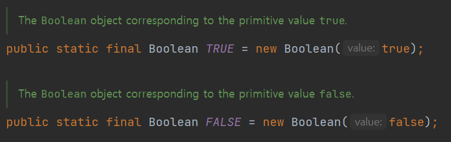

# Item01. 생성자 대신 정적 팩터리 메서드를 고려하라

생성자(constructor)는 객체 지향 프로그래밍에서 클래스의 인스턴스를 초기화하는 메서드이다. 주된 목적은 객체 생성
시점에 필요한 초기화 작업을 수행하는 것이다.

정적 팩터리 메서드(static factory method)는 생성자의 제한점에 대한 대안을 제공하는
재사용 가능한 소프트웨어 설계의 해결책이다.

정적 팩터리 메서드를 생성자 대신 사용함으로써 객체의 생성을 단순화하고 코드의 가독성을 높이는데
사용할 수 있다.


## 정적 팩터리 메서드가 생성자보다 좋은 이유

정적 팩터리 메서드가 생성자보다 좋은 이유 다섯가지는 다음과 같다.

1. 이름을 가질 수 있다.
2. 호출될 때마다 인스턴스를 새로 생성하지는 않아도 된다.
3. 반환 타입의 하위 객체를 반환할 수 있는 능력이 있다.
4. 입력 매개변수에 따라 매번 다른 클래스의 객체를 반환할 수 있다.
5. 정적 팩터리 메서드를 작성하는 시점에는 반환할 객체의 클래스가 존재하지 않아도 된다.


### 1. 이름을 가질 수 있다.

생성자에 넘기는 매개변수와 생성자 자체만으로는 반환될 객체의 특성을 제대로 설명하지 못한다.


예를 들어, 아래와 같이 자동차(Car) 객체를 만들어보자.

```java

public static void main(String[] args) {
    Car electricCar = new Car("테슬라", "레드", 2022, 0, CarType.ELECTRIC);
    Car petrolCar = new Car("모닝", "블루", 2020, 50, CarType.PETROL);
    Car hybridCar = new Car("프리우스", "화이트", 2021, 30, CarType.HYBRID);
}

public static class Car {

    private final String name;
    private final String color;
    private final int year;
    private final int oil;
    private final CarType type;

    public Car(String name, String color, int year, int oil, CarType type) {
        this.name = name;
        this.color = color;
        this.year = year;
        this.oil = oil;
        this.type = type;
    }

    // CarType 열거형 정의
    public enum CarType {
        ELECTRIC, PETROL, HYBRID
    }
}

```

main 메서드를 보면, 같은 생성자로 여러가지 타입의 Car객체를 생성해 주고 있다.\
하지만, 이 생성자만으로는 의미가 명확하게 전달되지 않는다는 것이 느껴질 것이다.

<br><br>

이 코드를 정적 팩터리 메서드를 사용하면, 아래와 같이 변경할 수 있다.


```java
public static void main(String[] args) {
    Car electricCar = Car.createElectricCar("테슬라", "레드", 2022);
    Car petrolCar = Car.createPetrolCar("모닝", "블루", 2020, 50);
    Car hybridCar = Car.createHybridCar("프리우스", "화이트", 2021, 30);
}

public static class Car {
    private final String name;
    private final String color;
    private final int year;
    private final int oil;
    private final CarType type;

    private Car(String name, String color, int year, int oil, CarType type) {
        this.name = name;
        this.color = color;
        this.year = year;
        this.oil = oil;
        this.type = type;
    }

    public static Car createPetrolCar(String name, String color, int year, int oil) {
        return new Car(name, color, year, oil, CarType.PETROL);
    }

    public static Car createElectricCar(String name, String color, int year) {
        return new Car(name, color, year, 0, CarType.ELECTRIC);
    }

    public static Car createHybridCar(String name, String color, int year, int oil) {
        return new Car(name, color, year, oil, CarType.HYBRID);
    }

    // CarType 열거형 정의
    public enum CarType {
        ELECTRIC, PETROL, HYBRID
    }
}

```

main 메서드만 읽어보더라도, 어떤 Car객체를 생성하고 있는지 의미를 명확히 알 수 있다.

단편적인 예시로 생성자가 하나인 경우만 살펴 보았지만, 정적 팩터리 메서드의 경우에는
생성자가 여러개인 경우에 특히 유리하게 작용한다.

<br><br>


### 2. 호출될 때마다 인스턴스를 새로 생성하지는 않아도 된다.

이미 생성된 객체를 재사용함으로써 메모리 사용을 줄이고 성능을 향상시킬 수 있다.
이는 특히 불변 객체(immutable objects)를 다룰때 유용하다.

대표적인 예로 Boolean 클래스의 valueOf 메서드는 True, False 값을 가진 Bollean 객체를 반환한다.
이때, 미리 생성해둔 값을 사용하여 효과적으로 처리한다.




```java
public static Boolean valueOf(boolean b) {
    return (b ? Boolean.TRUE : Boolean.FALSE);
}
```


<br><br>

### 3. 반환 타입의 하위 타입 객체를 반환할 수 있는 능력이 있다.

정적 팩터리 메서드가 인터페이스나 상위 클래스 타입을 반환 타입으로 사용하면서, 
실제로는 이 인터페이스나 클래스의 어떤 하위 타입(subtype)의 인스턴스를 반환할 수 있음을 의미다. 

이 접근 방식은 API의 유연성을 제공해주고, 
클라이언트에 필요 이상의 많은 정보를 노출하지 않고 API를 설계할 수 있게 해주어서 보안 측면으로도 유리하다.


```java

public interface Shape {
    // Shape interface methods
}

public class Circle implements Shape {
    // Circle implementation
}

public class ShapeFactory {
    public static Shape newCircle() {
        return new Circle();
    }
}

```

간단하게 위 예제처럼 작성하여 이 특성을 사용할 수 있다.
newCircle() 메서드는 Shape 타입을 반환하지만, 실제로는 Circle 객체를 생성하여 반환한다.

이러한 방식은 클라이언트 코드가 구체적인 클래스(Circle)보다는 인터페이스(Shape)에 의존하도록 유도하는 것이다.
이는 Circle의 구현이 변경되더라도 클라이언트 코드에 영향을 주지 않고, 더 유연하고 확장 가능한
코드를 작성할 수 있게끔 한다.


<br><br>

그리고 Java의 Collections에는 내부 구현의 숨김과 정보 은닉에 관한 특징이 잘 나타나 있다.

```java
List<String> list = new ArrayList<>();
List<String> unmodifiableList = Collections.unmodifiableList(list);
```

Collections.unmodifiableList()는 매개변수로 받은 List를 수정할 수 없는 List로 만들어주는 메서드이다.
메서드의 반환 타입은 List 인터페이스이지만, 실제로 unmodifiableList()는 List 인터페이스를 구현하고 있는
어떤 구체적인 하위 클래스를 반환한다.

하지만 사용자는 이 클래스를 굳이 알 필요 없이, List로 사용하면 되는 것이다.

이를 통해, 사용자는 해당 클래스의 구현체를 알 필요 없이 List 인터페이스에 맞게 쉽게 사용할 수 있고,
그와 동시에 내부 구현이 숨겨지면서 정보은닉에 유용하게 된다.


<br><br>

### 4. 입력 매개변수에 따라 매번 다른 클래스의 객체를 반환할 수 있다.

정적 메서드는 매개변수의 값이나 타입에 따라 다른 클래스의 인스턴스를 반환할 수 있다.
또한, 조건적으로 객체를 생성하게 할 수 있으며

이 방식을 사용하면, 다양한 타입의 객체를 생성하는 복잡한 로직을 한 메서드 안에 캡슐화 할 수 있다.


```java
public interface Parser {
    Object parse(String input);
}

public class JsonParser implements Parser {
    public Object parse(String input) {
        // JSON parsing
        return new Object();
    }
}

public class XmlParser implements Parser {
    public Object parse(String input) {
        // XML parsing
        return new Object();
    }
}

public class ParserFactory {
    public static Parser getParser(String type) {
        if ("JSON".equals(type)) {
            return new JsonParser();
        } else if ("XML".equals(type)) {
            return new XmlParser();
        }
        throw new IllegalArgumentException("Unknown type: " + type);
    }
}
```

위 예제에서, ParserFactory의 getParser를 통해 type을 매개변수로 받고 있다.

이때, type이 Json이라면 JsonParser 객체를, XML 이라면 XMLParser 객체를 반환 해 준다.

이처럼 정적 팩터리 메서드를 사용하여 API를 유연하게 설계할 수 있고, 가독성과 유지보수성을 향상 시킬 수 있다.


<br><br>

### 5. 정적 팩터리 메서드를 작성하는 시점에는 반환할 객체의 클래스가 존재하지 않아도 된다.

정적 팩터리 메서드의 유연성과 확장성을 매우 잘 보여주는 특징이다.\
이 특징은 특히 서비스 제공자 프레임워크(Service Provider Framework) 같은 디자인 패턴에서 유용하게 사용된다.

서비스 제공자 프레임워크는 세 가지 주요 컴포넌트로 구성된다.
1. 서비스 인터페이스
2. 서비스 제공자 인터페이스
3. 서비스 접근 API

자바 6이전에는 JDBC가 서비스 제공자 프레임워크에 해당되고,
자바 6이후에는 ServiceLoader가 제공되어 프레임워크를 직접 만들 필요가 거의 없어졌다.


정적 팩터리 메서드는 실행 시간(Runtime)에 클래스가 로드되고 인스턴스가 생성된다.
이 방식은 메서드를 정의할 때는 해당 클래스가 존재하지 않더라도, 
나중에 클래스가 로드되면 해당 클래스의 인스턴스를 반환할 수 있게 한다.


```java
public interface Service {
    // 서비스 인터페이스 정의
}

public class ServiceProvider {
    // 서비스 제공자 구현
}

    // 서비스 로더를 사용하여 서비스 제공자 로드
ServiceLoader<Service> loader = ServiceLoader.load(Service.class);
for (Service service : loader) {
    // 사용 가능한 서비스 사용
}

```

ServiceLoader.load(Service.class) 호출은 Service 인터페이스의 모든 사용 가능한 구현체를 로드한다.

이때, Service 인터페이스를 구현하는 구체적인 클래스들은 ServiceLoader가 작성되는 시점에 존재하지 않을 수도 있다.


---

## 정적 팩터리 메서드 단점

### 1. 상속의 제한

정적 팩터리 메서드를 사용하는 클래스는 대체로 생성자를 공개하지 않고, 
객체 생성을 전적으로 이러한 메서드에 의존하도록 설계된다.

특히 클래스가 private 또는 protected 생성자만 제공하고, 정적 팩터리 메서드로만 인스턴스를 생성할 수 있도록 설계되었을 때, 
이 클래스를 상속받는 것이 불가능하다.

또한, 객체 생성을 전적으로 메서드에 의존하게 설계되기 때문에,
이 클래스를 상속받아 새로운 하위 클래스를 만드는 것도 어렵거나 불가능할 수 있다.


```java
public class BaseClass {
    private BaseClass() {
        // private 생성자
    }

    public static BaseClass createInstance() {
        return new BaseClass();
    }
}

public class DerivedClass extends BaseClass {
    public DerivedClass() {
        // 컴파일 에러: BaseClass의 생성자에 접근할 수 없음
    }
}

```

위 예제에서, DerivedClass클래스는 BaseClass를 상속 받으려 하지만,
BaseClass의 생성자에 접근할 수 없기 때문에 컴파일 에러가 발생한다.


### 2. 정적 팩터리 메서드 발견성 문제

앞서 언급한 이름을 지을 수 있다는 특징과 상반된 단점이다.

이름을 지음으로써 코드의 의미와 명확성을 확실히 챙길 수 있는 반면,
개발자가 해당 정적 팩터리 메서드의 존재를 모른다면 다 의미 없다는 말이다.


```java
public class Complex {
    private double real;
    private double imaginary;

    private Complex(double real, double imaginary) {
        this.real = real;
        this.imaginary = imaginary;
    }

    public static Complex fromPolar(double magnitude, double angle) {
        return new Complex(magnitude * Math.cos(angle), magnitude * Math.sin(angle));
    }
}

// 사용 시
Complex c = Complex.fromPolar(1, Math.PI);

```

위 예제와 같이 정적 팩터리 메서드를 사용하는 예제가 있다.\
개발자는 fromPolar() 메서드를 이용하여 복소수를 편하게 만들면 좋겠지만, 개발자는 해당 메서드를 찾기 위한 노력을 해야한다.

생성자처럼 API설명에 명확히 드러나지 않는다는 것이다.

---

## 정적 팩터리 메서드 명명 방식


### [Type]from:
매개변수 하나를 받아서 해당 타입의 인스턴스를 반환한다.

ex) Date.from(Instant)

### of:
여러 매개변수를 받아 적합한 타입의 인스턴스를 반환한다.

ex) List.of(1, 2, 3)


### valueOf: 
매개변수로 전달된 값으로 해당 타입의 인스턴스를 반환한다. 
valueOf는 주로 타입 변환에 사용됩니다.

ex) Integer.valueOf(String)


### getInstance, instance: 
인스턴스를 반환하지만, 같은 인스턴스임이 보장되지 않는다. 
매개변수에 따라 다른 인스턴스를 반환할 수 있다.

ex) Calendar.getInstance()

### newInstance, create: 
새로운 인스턴스를 생성한다. 
getInstance와 달리 항상 새로운 인스턴스를 생성함을 나타낸다.

ex) Array.newInstance(Class, int)

### get[Type]: 
특정 타입의 객체를 반환합니다. 
이 방식은 주로 다른 클래스나 타입의 객체를 반환할 때 사용된다.

ex) Files.getBufferedReader(Path)

### new[Type]: 
newInstance와 유사하지만, 생성되는 객체의 타입을 명시적으로 나타낸다.

ex) Files.newBufferedReader(Path)

### [Type]:

getType, newType의 간결한 버전이다.

ex) Collections.list()


---

정적 팩터리가 가져오는 이점은 많지만, 그렇다고 정적 팩터리 메서드가 항상 생성자보다 낫다고 할 수는 없다. 

상황에 따라 적절한 방법을 선택하는 것이 중요하다.


