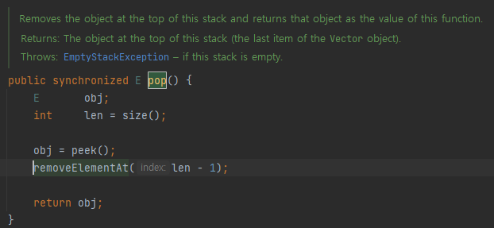
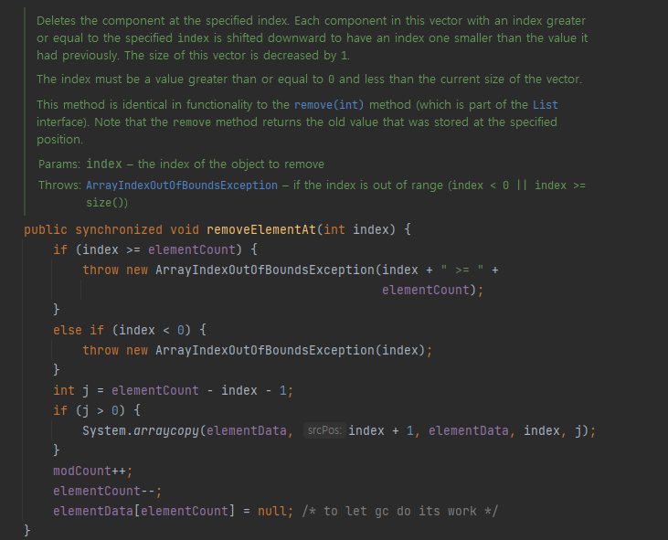
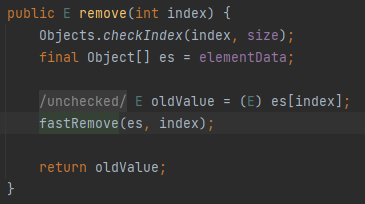
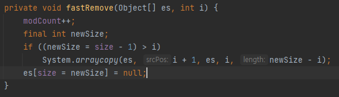

# 다 쓴 객체 참조를 해제하라

다 쓴 객체는 GC의 대상이 되어, 자바에서는 자동으로 메모리 해제가 된다.
하지만 반대로, GC 언어에서 메모리 누수를 찾기가 아주 까다로운데,
다 쓴 객체의 참조가 하나라도 살아 있으면 GC의 대상이 되지 않기 때문이다.

예를 들어, 사용자가 임의로 만든 Stack.class 가 있다고 하자.

```java
public class Stack {
    private Object[] elements;
    private int size = 0;
    private static final int DEFAULT_INITIAL_CAPACITY = 16;

    public Stack() {
        elements = new Object[DEFAULT_INITIAL_CAPACITY];
    }

    public void push(Object e) {
        ensureCapacity();
        elements[size++] = e;
    }

    public Object pop() {
        if (size == 0)
            throw new EmptyStackException();
        Object result = elements[--size];
        return result;
    }

    private void ensureCapacity() {
        /* 생략 */
    }
    
}
```

해당 Stack에서는 얼핏 보면 pop(), push()를 잘 해 주는 Stack 처럼 보이지만,
pop() 되어 다 쓴 객체가 참조 해제되지않고, 여전히 elements에 살아있게 된다 .

따라서 GC는 해당 pop된 객체를 회수할 수 없고, 이는 불필요하게 메모리 사용량을
늘리게 된다.

<br><br>

해법은 간단히 해당 객체에 null 처리를 해 주어, 참조를 해제하면 된다.

```java
public Object pop() {
        if (size == 0)
            throw new EmptyStackException();
        Object result = elements[--size];
        elements[size] = null; // 다 쓴 참조 해제
        return result;
}
```

이처럼 null 처리를 해 주면, GC의 대상이 되도록 명시할 수 있고, 실수로 다 쓴 객체를 참조하려고 할 때는
NPE를 던지면서 프로그램 오류를 조기에 발견 할 수 있게 해준다.

이 같은 이점때문에 많은 개발자들이 null처리에 혈안이 되곤 하는데,
사실 객체 참조를 null 처리 하는 것은 예외적인 경우여야 한다.


<br><br>
그 이유는 실제 Java의 Collection들은 이미 객체 참조 해제가 이루어지고 있기 때문이다.


## Java Collection의  객체 참조 해제





실제 Stack 클래스의 pop() 메서드는 Vector 클래스를 상속받고 있고,
Vector 클래스의 removeElementAt() 메서드를 이용한다.





Vector 클래스의 removeElementAt() 메서드의 경우 구현 마지막 부분에
`elementData[elementCount] = null;` 을 통해 명시적으로 null 처리를 해 주고 있고,
주석으로 친절하게 GC 대상이 되게하는 코드로 설명까지 되어 있다.

<br><br>





또한 자바에서 ArrayList와 같은 Collection들은 모두 요소 제거 작업을 할 때,
명시적으로 null 처리를 해 주며 객체 참조에 대한 해제를 하고 있다.

<br><br>

---

## 그렇다면 개발자들은 어떤 부분을 신경써야 할까?


### 1. 객체 참조 관리

객체가 필요하지 않을 때, 객체의 참조를 해제한다.

```java
List<String> strList = new ArrayList<>();
strList.add("Java");
strList.add("Python");

strList.clear(); // 리스트를 비워 참조를 해제
```
```java
List<Object> objectList = new ArrayList<>();
Object obj = new Object();
objectList.add(obj);
objectList.remove(obj);

obj = null; // 객체 참조를 해제
```


위 방법은 단편적인 예시로,\
실제 다 쓴 참조를 해제하는 가장 좋은 방법은 변수를 Scope 밖으로 밀어내는 것이다.

```java
public class ScopeExample {
    public static void main(String[] args) {

        createAndUseObject();
        // 이 시점에서 obj는 더 이상 접근할 수 없다.

        // 다른 작업을 수행
        otherThing();
    }

    private static void createAndUseObject() {
        Object obj = new Object();
        System.out.println(obj);
    }

    private static void otherThing() {
        // 다른 작업 수행
        System.out.println("other..");
    }
}
```


<br>

### 2. 리소스 해제

리소스의 경우 GC가 자동으로 관리하지 않기 때문에, 적절히 해제해 주는 것이 중요하다.
예를 들어, 파일이나 데이터베이스 연결과 같은 리소스를 사용한 후 명시적으로 해제해준다.

```java
try (FileReader fr = new FileReader("example.txt");
     BufferedReader br = new BufferedReader(fr)) {
    String line;
    while ((line = br.readLine()) != null) {
        System.out.println(line);
    }
} catch (IOException e) {
    e.printStackTrace();
}
// try-with-resources 구문이 자동으로 리소스를 닫아줌
```
<br>

### 3. 캐시

캐시를 사용할 때, 객체 참조를 캐시에 넣어두고 이 사실을 잊은 채 그냥 놔두는 일을
자주 접할 수 있다.

```java
public class MemoryLeakExample {
    private Map<String, Object> cache = new HashMap<>();

    public void addToCache(String key, Object value) {
        if (!cache.containsKey(key)) {
            cache.put(key, value);
        }
    }
    // 이 메서드는 객체를 계속 캐시에 추가만 하고, 제거하지 않음
}
```

만약 운 좋게 캐시 외부에서 키를 참조하는 동안만 엔트리가 살아 있는 캐시가
필요한 상황이라면 WeakHashMap을 사용해 캐시를 만들자.


```java
public class WeakHashMapExample {
    public static void main(String[] args) {
        Map<Object, String> weakHashMap = new WeakHashMap<>();
        Object key = new Object();

        weakHashMap.put(key, "Example Value");

        // 키에 대한 참조가 존재하는 동안은 데이터가 유지됨
        System.out.println("Before removing reference: " + weakHashMap.containsKey(key));
        
        key = null; // 키에 대한 참조를 제거, 이제 GC의 대상이 된다
    }
}
```
WeakHashMap은 key에 대한 다른 강한 참조가 있지 않다면, 언제든지 GC의 대상이 될 수 있다.

하지만 WeakHashMap은 메모리 관리 측면에서 유리하지만, 키 객체에 대한 다른 참조가 
없을 경우 예기치 않게 데이터가 사라질 수 있으므로 주의가 필요하다.

<br><br>

캐시를 만들 떄 보통은 캐시 엔트리의 유효 기간을 정하기 어렵기 때문에, 시간이 지날수록
엔트리의 가치를 떠러뜨리는 방식을 흔히 사용한다. 이런 방식에서는 쓰지 않는 엔트리를
백그라운드 스레드나 캐시에 새 엔트리를 추가할 떄, 부수적인 작업으로 정리해 줘야 한다.

아래는 시간에 따라 캐시의 가치를 떨어뜨리는 단편적 예시이다.

```java
public class ExpiringCache<K, V> {
    private class CacheEntry {
        V value;
        long timeStamp;
        int score;

        CacheEntry(V value, int score) {
            this.value = value;
            this.timeStamp = System.currentTimeMillis();
            this.score = score;
        }
        
        void decreaseScore() { // 시간이 지남에 따라 점수 감소
            long currentTime = System.currentTimeMillis();
            long age = currentTime - this.timeStamp;
            this.score -= (int) (age / 1000); // 예시: 1초마다 1점 감소
        }
    }

    private Map<K, CacheEntry> cache = new HashMap<>();

    public void put(K key, V value, int initialScore) {
        cache.put(key, new CacheEntry(value, initialScore));
    }

    public V get(K key) {
        CacheEntry entry = cache.get(key);
        if (entry == null) return null;

        entry.decreaseScore();
        if (entry.score <= 0) {
            cache.remove(key);
            return null;
        }

        return entry.value;
    }

    // 캐시 정리 (점수가 낮은 엔트리 제거)
    public void cleanup() {
        cache.entrySet().removeIf(e -> e.getValue().score <= 0);
    }
}
```
<br>


### 4. 콜백 함수와 리스너

객체들은 종종 다른 객체에 등록되어 이벤트나 특정 조건 발생 시 호출되도록 설계되어 있다.

예를 들어 객체가 리스너로 등록 되면, 해당 리스너를 가지고 있는 객체는 리스너에 대한 참조를 유지한다.\
이 리스너 역시, 사용하지 않는다면 해제 해 주어야 한다.

```java
public class SimpleEventExample {
    public static void main(String[] args) {
        EventManager manager = new EventManager();

        EventListener listener = new EventListener() {
            @Override
            public void onEvent() {
                System.out.println("Event occurred!");
            }
        };

        manager.addListener(listener);
        manager.fireEvent(); // 이벤트 발생

        manager.removeListener(listener); // 리스너 해제
    }
}
```

<br>

---


메모리 누수는 겉으로 잘 드러나지 않아 시스템에 수 년간 잠복하는 사례도 있다.
이러한 누수는 철저한 코드 리뷰나 힙 프로파일러와 같은 디버깅 도구를 동원해야만
발견되기도 한다.

따라서, 위와 같은 예방법을 익혀두는 것이 중요하다.


